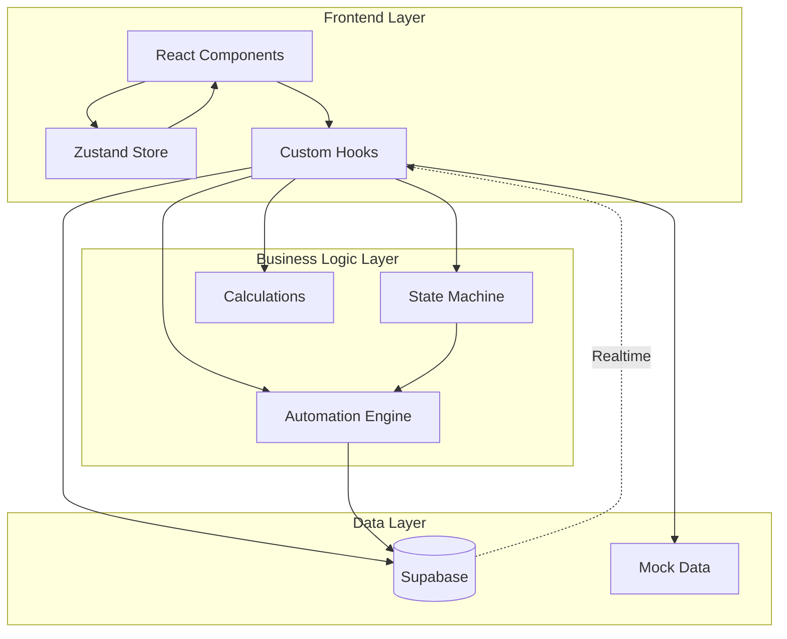

# Design Document: KitchenOS

## Overview

KitchenOS is an autonomous restaurant operations system that integrates Order Entry, Kitchen Display, Inventory Management, and Staff Tasking into a unified event-driven pipeline. The system is built as a desktop-first React web application using TypeScript, Tailwind CSS, and Supabase as the backend.

### Core Design Principles

1. **Event-Driven Architecture**: All system actions are triggered by state transitions in the order pipeline state machine
2. **Deterministic Automation**: Business logic is hardcoded and predictable (no external ML APIs)
3. **Real-Time Synchronization**: UI updates instantly via Supabase Realtime or polling fallback
4. **Graceful Degradation**: System operates in mock data mode when Supabase is unavailable
5. **Zero External Dependencies**: No paid APIs, services, or external integrations beyond Supabase free tier

### Technology Stack

- **Frontend**: React 18 + TypeScript + nextjs
- **Styling**: Tailwind CSS v3 (cyber-industrial design system)
- **State Management**: Zustand (lightweight, minimal boilerplate)
- **Database**: Supabase (PostgreSQL + Realtime + Auth)
- **Drag & Drop**: @hello-pangea/dnd (accessible kanban implementation)
- **Charts**: Recharts (demand forecasting visualization)
- **Icons**: lucide-react
- **Fonts**: Inter (UI text) + JetBrains Mono (data/logs)

### Key Research Findings

Based on research into the selected technologies:

1. **@hello-pangea/dnd**: Provides accessible drag-and-drop with `DragDropContext`, `Droppable`, and `Draggable` components. Supports controlled state updates via `onDragEnd` callback, enabling integration with state machine validation ([source](https://github.com/hello-pangea/dnd)).

2. **Supabase Realtime**: Uses PostgreSQL's replication features to broadcast changes. React integration pattern: subscribe in `useEffect`, update local state in callback, unsubscribe on cleanup. Requires tables to be added to `supabase_realtime` publication ([source](https://leyaa.ai/codefly/learn/supabase/part-2/supabase-realtime-with-react-hooks)).

3. **Zustand Best Practices**: Create focused, modular stores. Use selectors to prevent unnecessary re-renders. Separate actions from state. Avoid putting derived state in the store—compute it with selectors ([source](https://feature-sliced.design/blog/zustand-simple-state-guide)).

4. **State Machine Pattern**: Model order workflow as explicit state transitions with validation. Each transition triggers side effects (logging, inventory updates, task creation). TypeScript discriminated unions enforce valid states at compile time ([source](https://www.hedgeui.com/blog/typescript-patterns-financial-data-react)).

5. **React Performance**: Use `useMemo` for expensive computations (priority sorting, demand calculations). Use `useCallback` for callbacks passed to child components. Use `React.memo` on list item components. Measure first, optimize hot paths ([source](https://copyprogramming.com/howto/react-usememo-and-usecallback)).

## Architecture

### System Architecture Diagram



### Module Architecture

KitchenOS consists of four primary modules, each with distinct responsibilities:

#### 1. Command Center (Manager Dashboard)
- **Purpose**: System overview, metrics, pipeline logs, manual override control
- **Components**: MetricsGrid, PipelineLogFeed, ManualOverrideToggle, SystemStatus
- **Data Sources**: All tables (orders, inventory, staff_tasks, pipeline_logs)
- **Key Features**: Real-time metrics calculation, live log streaming, system-wide controls

#### 2. Kitchen Display System (KDS)
- **Purpose**: Kanban board for kitchen staff to manage order pipeline
- **Components**: KanbanBoard, OrderCard, ColumnContainer, DragDropProvider
- **Data Sources**: orders table
- **Key Features**: Drag-and-drop state transitions, priority sorting, countdown timers, visual warnings

#### 3. AI Hub (Inventory & Forecasting)
- **Purpose**: Inventory tracking, demand forecasting, stock alerts
- **Components**: InventoryList, DemandChart, StockAlerts, InventoryProgressBar
- **Data Sources**: inventory table, orders table (for demand calculation)
- **Key Features**: Real-time stock levels, color-coded alerts, demand visualization

#### 4. Staff Dispatch (Task Management)
- **Purpose**: Automated task generation and assignment
- **Components**: TaskList, TaskCard, TaskFilters, TaskStatusBadge
- **Data Sources**: staff_tasks table
- **Key Features**: Auto-generated tasks, priority-based sorting, round-robin assignment

### Component Hierarchy

```
App
├── AppShell
│   ├── Sidebar (navigation)
│   ├── TopBar (status, time, user controls)
│   └── Outlet (page content)
│       ├── CommandCenter
│       │   ├── MetricsGrid
│       │   │   ├── MetricCard (revenue)
│       │   │   ├── MetricCard (active orders)
│       │   │   ├── MetricCard (avg wait time)
│       │   │   └── MetricCard (pending tasks)
│       │   ├── PipelineLogFeed
│       │   │   └── LogEntry[]
│       │   └── ManualOverrideToggle
│       ├── KitchenDisplay
│       │   └── KanbanBoard
│       │       ├── ColumnContainer (Pending)
│       │       │   └── OrderCard[]
│       │       ├── ColumnContainer (Cooking)
│       │       │   └── OrderCard[]
│       │       ├── ColumnContainer (Quality Check)
│       │       │   └── OrderCard[]
│       │       └── ColumnContainer (Ready)
│       │           └── OrderCard[]
│       ├── AIHub
│       │   ├── DemandChart
│       │   ├── InventoryList
│       │   │   └── InventoryItem[]
│       │   │       └── InventoryProgressBar
│       │   └── StockAlerts
│       │       └── AlertBadge[]
│       └── StaffDispatch
│           ├── TaskFilters
│           └── TaskList
│               └── TaskCard[]
```

### State Management Architecture

#### Zustand Store Structure

```typescript
// Global store (src/store/index.ts)
interface KitchenOSStore {
  // Manual override mode
  manualOverrideMode: boolean;
  setManualOverrideMode: (enabled: boolean) => void;
  
  // System status
  isOfflineMode: boolean;
  setOfflineMode: (offline: boolean) => void;
  
  // UI state
  selectedModule: string;
  setSelectedModule: (module: string) => void;
}
```

**Design Decision**: Keep Zustand store minimal. Most data lives in component state managed by custom hooks. Zustand only stores truly global UI state (manual override, offline mode, navigation). This prevents store bloat and keeps data fetching logic in hooks where it belongs.

#### Custom Hooks Pattern

Each data domain has a dedicated hook that encapsulates:
- Data fetching from Supabase (with mock fallback)
- Real-time subscription management
- CRUD operations
- Loading and error states

**Hook Inventory**:
- `useOrders()`: Order CRUD, state transitions, priority calculation
- `useInventory()`: Inventory CRUD, stock level updates
- `useStaffTasks()`: Task CRUD, auto-generation logic
- `usePipelineLogs()`: Log creation, real-time feed
- `useRealtime()`: Supabase Realtime subscription wrapper
- `useMetrics()`: Derived metrics calculation (revenue, avg wait time, etc.)

### Real-Time Synchronization Design

#### Supabase Realtime Strategy

```typescript
// Pattern used in all data hooks
useEffect(() => {
  // Initial fetch
  fetchData();
  
  // Subscribe to realtime updates
  const channel = supabase
    .channel('table-changes')
    .on('postgres_changes', 
      { event: '*', schema: 'public', table: 'orders' },
      (payload) => {
        // Update local state based on event type
        handleRealtimeUpdate(payload);
      }
    )
    .subscribe();
  
  // Cleanup
  return () => {
    supabase.removeChannel(channel);
  };
}, []);
```

#### Fallback Polling Strategy

When Supabase Realtime is unavailable (detected by connection errors), fall back to polling:

```typescript
useEffect(() => {
  if (isOfflineMode) {
    const interval = setInterval(() => {
      fetchData(); // Re-fetch every 5 seconds
    }, 5000);
    
    return () => clearInterval(interval);
  }
}, [isOfflineMode]);
```

**Design Decision**: Prefer Supabase Realtime for production. Use polling as fallback only. Polling interval set to 5 seconds to balance freshness with API rate limits on free tier.

## Components and Interfaces

### Core Type Definitions

```typescript
// src/types/index.ts

export type OrderStatus = 'pending' | 'cooking' | 'quality_check' | 'ready' | 'dispatched';

export interface Order {
  id: string;
  tableNumber: number;
  items: OrderItem[];
  status: OrderStatus;
  priorityScore: number;
  createdAt: string;
  startedAt: string | null;
  dispatchedAt: string | null;
  countdownTimer: number | null; // seconds remaining
}

export interface OrderItem {
  name: string;
  quantity: number;
  prepTime: number; // minutes
}

export interface InventoryItem {
  id: string;
  itemName: string;
  stockLevel: number; // percentage 0-100
  reorderPoint: number; // percentage threshold
  unit: string;
}

export interface StaffTask {
  id: string;
  taskType: 'delivery' | 'cleaning' | 'restock' | 'custom';
  description: string;
  assignedTo: string | null;
  status: 'pending' | 'in_progress' | 'completed';
  priority: 'high' | 'medium' | 'low';
  createdAt: string;
}

export interface PipelineLog {
  id: string;
  timestamp: string;
  level: 'INFO' | 'WARN' | 'ERROR';
  message: string;
}

export interface DemandForecast {
  hour: number; // 0-23
  projected: number; // predicted order count
  actual: number; // actual order count
}
```

### State Machine Interface

```typescript
// src/lib/stateMachine.ts

export interface StateTransition {
  from: OrderStatus;
  to: OrderStatus;
  validate: (order: Order) => boolean;
  execute: (order: Order) => Promise<void>;
}

export const ORDER_STATE_MACHINE: Record<OrderStatus, OrderStatus | null> = {
  pending: 'cooking',
  cooking: 'quality_check',
  quality_check: 'ready',
  ready: 'dispatched',
  dispatched: null, // terminal state
};

export function canTransition(from: OrderStatus, to: OrderStatus): boolean {
  return ORDER_STATE_MACHINE[from] === to;
}

export async function transitionOrder(
  order: Order,
  newStatus: OrderStatus,
  manualOverride: boolean
): Promise<void> {
  // Validate transition
  if (!manualOverride && !canTransition(order.status, newStatus)) {
    throw new Error(`Invalid transition: ${order.status} -> ${newStatus}`);
  }
  
  // Execute side effects based on transition
  await executeTransitionSideEffects(order, newStatus);
  
  // Update order status
  await updateOrderStatus(order.id, newStatus);
  
  // Log transition
  await createPipelineLog({
    level: manualOverride ? 'WARN' : 'INFO',
    message: manualOverride 
      ? `MANUAL: Order #${order.id} moved to ${newStatus}`
      : `Order #${order.id} transitioned to ${newStatus}`,
  });
}
```

### Automation Engine Interface

```typescript
// src/lib/automation.ts

export interface AutomationRule {
  trigger: 'order_status_change' | 'inventory_low' | 'timer_expired';
  condition: (context: any) => boolean;
  action: (context: any) => Promise<void>;
}

export async function executeTransitionSideEffects(
  order: Order,
  newStatus: OrderStatus
): Promise<void> {
  switch (newStatus) {
    case 'cooking':
      // Calculate countdown timer
      const totalPrepTime = order.items.reduce(
        (sum, item) => sum + (item.prepTime * item.quantity),
        0
      );
      await updateOrderTimer(order.id, totalPrepTime * 60); // convert to seconds
      break;
      
    case 'quality_check':
      // Auto-create delivery task
      await createStaffTask({
        taskType: 'delivery',
        description: `Deliver order #${order.id} to table ${order.tableNumber}`,
        priority: 'high',
      });
      break;
      
    case 'dispatched':
      // Decrement inventory
      await decrementInventory(order.items);
      
      // Auto-create cleaning task
      await createStaffTask({
        taskType: 'cleaning',
        description: `Clean and reset table ${order.tableNumber}`,
        priority: 'low',
      });
      break;
  }
}

export async function decrementInventory(items: OrderItem[]): Promise<void> {
  for (const item of items) {
    const deductions = INGREDIENT_DEDUCTION_MAP[item.name];
    if (!deductions) continue;
    
    for (const { ingredientId, quantityPerItem } of deductions) {
      const inventory = await getInventoryItem(ingredientId);
      const newStockLevel = Math.max(0, inventory.stockLevel - (quantityPerItem * item.quantity));
      
      await updateInventoryStockLevel(ingredientId, newStockLevel);
      
      // Check if restock needed
      if (newStockLevel < inventory.reorderPoint) {
        await createRestockTask(inventory);
      }
    }
  }
}
```

### API Interface Specifications

#### Supabase Client Wrapper

```typescript
// src/lib/supabase.ts

import { createClient } from '@supabase/supabase-js';

const supabaseUrl = import.meta.env.nextjs_SUPABASE_URL as string;
const supabaseAnonKey = import.meta.env.nextjs_SUPABASE_ANON_KEY as string;

if (!supabaseUrl || !supabaseAnonKey) {
  console.error('[KitchenOS] Missing Supabase environment variables');
}

export const supabase = createClient(supabaseUrl, supabaseAnonKey);

// Typed query helpers
export async function fetchOrders(): Promise<Order[]> {
  const { data, error } = await supabase
    .from('orders')
    .select('*')
    .order('priority_score', { ascending: false });
  
  if (error) throw error;
  return data as Order[];
}

export async function updateOrderStatus(
  id: string,
  status: OrderStatus
): Promise<void> {
  const { error } = await supabase
    .from('orders')
    .update({ status })
    .eq('id', id);
  
  if (error) throw error;
}

// Similar helpers for inventory, staff_tasks, pipeline_logs
```

## Data Models

### Database Schema

#### Orders Table

```sql
CREATE TABLE orders (
  id UUID PRIMARY KEY DEFAULT gen_random_uuid(),
  table_number INTEGER NOT NULL,
  items JSONB NOT NULL, -- Array of {name, quantity, prepTime}
  status TEXT NOT NULL CHECK (status IN ('pending', 'cooking', 'quality_check', 'ready', 'dispatched')),
  priority_score NUMERIC(5,2) NOT NULL DEFAULT 0,
  countdown_timer INTEGER, -- seconds remaining
  created_at TIMESTAMPTZ NOT NULL DEFAULT NOW(),
  started_at TIMESTAMPTZ,
  dispatched_at TIMESTAMPTZ
);

CREATE INDEX idx_orders_status ON orders(status);
CREATE INDEX idx_orders_priority ON orders(priority_score DESC);
CREATE INDEX idx_orders_created_at ON orders(created_at DESC);
```

#### Inventory Table

```sql
CREATE TABLE inventory (
  id UUID PRIMARY KEY DEFAULT gen_random_uuid(),
  item_name TEXT NOT NULL UNIQUE,
  stock_level NUMERIC(5,2) NOT NULL CHECK (stock_level >= 0 AND stock_level <= 100),
  reorder_point NUMERIC(5,2) NOT NULL CHECK (reorder_point >= 0 AND reorder_point <= 100),
  unit TEXT NOT NULL
);

CREATE INDEX idx_inventory_stock_level ON inventory(stock_level);
```

#### Staff Tasks Table

```sql
CREATE TABLE staff_tasks (
  id UUID PRIMARY KEY DEFAULT gen_random_uuid(),
  task_type TEXT NOT NULL CHECK (task_type IN ('delivery', 'cleaning', 'restock', 'custom')),
  description TEXT NOT NULL,
  assigned_to TEXT,
  status TEXT NOT NULL DEFAULT 'pending' CHECK (status IN ('pending', 'in_progress', 'completed')),
  priority TEXT NOT NULL CHECK (priority IN ('high', 'medium', 'low')),
  created_at TIMESTAMPTZ NOT NULL DEFAULT NOW()
);

CREATE INDEX idx_staff_tasks_status ON staff_tasks(status);
CREATE INDEX idx_staff_tasks_priority ON staff_tasks(priority);
```

#### Pipeline Logs Table

```sql
CREATE TABLE pipeline_logs (
  id UUID PRIMARY KEY DEFAULT gen_random_uuid(),
  timestamp TIMESTAMPTZ NOT NULL DEFAULT NOW(),
  level TEXT NOT NULL CHECK (level IN ('INFO', 'WARN', 'ERROR')),
  message TEXT NOT NULL
);

CREATE INDEX idx_pipeline_logs_timestamp ON pipeline_logs(timestamp DESC);
CREATE INDEX idx_pipeline_logs_level ON pipeline_logs(level);
```

### Row Level Security Policies

```sql
-- Enable RLS on all tables
ALTER TABLE orders ENABLE ROW LEVEL SECURITY;
ALTER TABLE inventory ENABLE ROW LEVEL SECURITY;
ALTER TABLE staff_tasks ENABLE ROW LEVEL SECURITY;
ALTER TABLE pipeline_logs ENABLE ROW LEVEL SECURITY;

-- Allow all operations for authenticated users (prototype: no role-based access)
CREATE POLICY "Allow all for authenticated users" ON orders
  FOR ALL USING (auth.role() = 'authenticated');

CREATE POLICY "Allow all for authenticated users" ON inventory
  FOR ALL USING (auth.role() = 'authenticated');

CREATE POLICY "Allow all for authenticated users" ON staff_tasks
  FOR ALL USING (auth.role() = 'authenticated');

CREATE POLICY "Allow all for authenticated users" ON pipeline_logs
  FOR ALL USING (auth.role() = 'authenticated');
```

### Realtime Publication

```sql
-- Add all tables to realtime publication
ALTER PUBLICATION supabase_realtime ADD TABLE orders;
ALTER PUBLICATION supabase_realtime ADD TABLE inventory;
ALTER PUBLICATION supabase_realtime ADD TABLE staff_tasks;
ALTER PUBLICATION supabase_realtime ADD TABLE pipeline_logs;
```

### Ingredient Deduction Map

```typescript
// src/lib/ingredientMap.ts

export interface IngredientDeduction {
  ingredientId: string;
  quantityPerItem: number; // percentage points to deduct
}

export const INGREDIENT_DEDUCTION_MAP: Record<string, IngredientDeduction[]> = {
  'Margherita Pizza': [
    { ingredientId: 'flour', quantityPerItem: 2.5 },
    { ingredientId: 'tomato-sauce', quantityPerItem: 1.5 },
    { ingredientId: 'mozzarella', quantityPerItem: 3.0 },
  ],
  'Caesar Salad': [
    { ingredientId: 'romaine-lettuce', quantityPerItem: 4.0 },
    { ingredientId: 'parmesan', quantityPerItem: 1.0 },
    { ingredientId: 'caesar-dressing', quantityPerItem: 2.0 },
  ],
  'Grilled Chicken': [
    { ingredientId: 'chicken-breast', quantityPerItem: 5.0 },
    { ingredientId: 'olive-oil', quantityPerItem: 0.5 },
  ],
  // ... additional menu items
};
```

### Mock Data Structure

```typescript
// src/lib/mockData.ts

export const mockOrders: Order[] = [
  {
    id: '1',
    tableNumber: 5,
    items: [
      { name: 'Margherita Pizza', quantity: 2, prepTime: 15 },
      { name: 'Caesar Salad', quantity: 1, prepTime: 5 },
    ],
    status: 'pending',
    priorityScore: 18.0,
    createdAt: new Date().toISOString(),
    startedAt: null,
    dispatchedAt: null,
    countdownTimer: null,
  },
  // ... additional mock orders
];

export const mockInventory: InventoryItem[] = [
  { id: 'flour', itemName: 'Flour', stockLevel: 75, reorderPoint: 20, unit: 'kg' },
  { id: 'tomato-sauce', itemName: 'Tomato Sauce', stockLevel: 15, reorderPoint: 25, unit: 'L' },
  // ... additional mock inventory
];

export const mockStaffTasks: StaffTask[] = [
  {
    id: '1',
    taskType: 'delivery',
    description: 'Deliver order #1 to table 5',
    assignedTo: 'John',
    status: 'pending',
    priority: 'high',
    createdAt: new Date().toISOString(),
  },
  // ... additional mock tasks
];

export const mockPipelineLogs: PipelineLog[] = [
  {
    id: '1',
    timestamp: new Date().toISOString(),
    level: 'INFO',
    message: 'Order #1 created for table 5',
  },
  // ... additional mock logs
];
```

## Correctness Properties

*A property is a characteristic or behavior that should hold true across all valid executions of a system—essentially, a formal statement about what the system should do. Properties serve as the bridge between human-readable specifications and machine-verifiable correctness guarantees.*

Before defining correctness properties, I need to analyze which acceptance criteria are suitable for property-based testing using the prework tool.


### Property 1: State Machine Enforces Valid Sequential Transitions

*For any* order in any valid state, attempting to transition to a non-sequential state SHALL be rejected, and only transitions to the immediate next state in the sequence (pending → cooking → quality_check → ready → dispatched) SHALL succeed.

**Validates: Requirements 1.1**

### Property 2: Countdown Timer Calculation Matches Formula

*For any* order with items, when transitioning from pending to cooking, the countdown timer SHALL equal the sum of (item.prepTime × item.quantity) for all items in the order, converted to seconds.

**Validates: Requirements 1.2**

### Property 3: Delivery Task Created on Order Ready

*For any* order transitioning to 'quality_check' or 'ready' status, a staff task of type 'delivery' SHALL be auto-created with a description containing the order ID and table number.

**Validates: Requirements 1.3, 4.1**

### Property 4: Inventory Deduction Matches Ingredient Map

*For any* order transitioning to 'dispatched' status, the stock level of each inventory item SHALL be decremented by the quantity specified in the Ingredient_Deduction_Map for each order item, multiplied by the item quantity.

**Validates: Requirements 1.4, 3.1, 3.2**

### Property 5: Cleaning Task Created on Order Dispatch

*For any* order transitioning to 'dispatched' status, a staff task of type 'cleaning' SHALL be auto-created with a description containing the table number.

**Validates: Requirements 1.5, 4.2**

### Property 6: Invalid State Transitions Rejected

*For any* order, attempting to transition to a state that is not the immediate next state in the pipeline sequence SHALL result in rejection and an error log entry.

**Validates: Requirements 1.6**

### Property 7: All State Transitions and Automation Events Logged

*For any* order state transition, inventory deduction, or staff task creation, a pipeline log entry SHALL be created with a timestamp, appropriate level (INFO/WARN/ERROR), and descriptive message.

**Validates: Requirements 1.7, 3.5, 4.6**

### Property 8: Priority Score Calculation Formula

*For any* order, the priority score SHALL equal (totalPrepTime × 0.6) + (waitTime × 0.4), where totalPrepTime is the sum of all item prep times and waitTime is the time elapsed since order creation.

**Validates: Requirements 2.1**

### Property 9: Orders Sorted by Priority Score Descending

*For any* array of pending orders, the sorting function SHALL produce an array ordered by priority score in descending order (highest priority first).

**Validates: Requirements 2.3**

### Property 10: Restock Task Created When Inventory Below Reorder Point

*For any* inventory item, when its stock level falls below its reorder point after a deduction, a staff task of type 'restock' SHALL be auto-created with a description containing the item name and current stock level.

**Validates: Requirements 3.3, 4.3**

### Property 11: Task Creation Idempotency

*For any* triggering event (order transition, inventory threshold), executing the same event multiple times SHALL result in at most one staff task being created for that specific event.

**Validates: Requirements 3.4, 4.7**

### Property 12: Stock Level Clamped to Zero

*For any* inventory item, when a deduction would result in a negative stock level, the stock level SHALL be set to 0% and a warning log entry SHALL be created.

**Validates: Requirements 3.6**

### Property 13: Inventory Deduction Idempotency

*For any* order, dispatching the same order multiple times SHALL result in inventory being decremented exactly once.

**Validates: Requirements 3.7**

### Property 14: Round-Robin Task Assignment

*For any* sequence of auto-created staff tasks, the assigned staff member SHALL follow a round-robin pattern across the available staff list, ensuring even distribution.

**Validates: Requirements 4.4**

### Property 15: Task Priority Based on Type

*For any* auto-created staff task, the priority SHALL be 'high' for delivery tasks, 'medium' for restock tasks, and 'low' for cleaning tasks.

**Validates: Requirements 4.5**

### Property 16: Order Card Rendering Includes All Required Fields

*For any* order, the rendered order card SHALL include the order number, table number, items list, priority score, and elapsed time.

**Validates: Requirements 5.2**

### Property 17: Timer Warning Logic

*For any* order in 'cooking' status, the warning indicator SHALL be displayed when the countdown timer is less than 20% of the original timer value.

**Validates: Requirements 5.6**

### Property 18: Demand Projection Calculation

*For any* set of historical order data, the projected demand for each hour SHALL be calculated as the average number of orders in that hour across all historical days.

**Validates: Requirements 6.2**

### Property 19: Actual Demand Counting

*For any* set of orders for the current day, the actual demand for each hour SHALL equal the count of orders created during that hour.

**Validates: Requirements 6.3**

### Property 20: Demand Highlighting Logic

*For any* hour, the hour SHALL be highlighted when actual demand exceeds projected demand by more than 20% (actual > projected × 1.2).

**Validates: Requirements 6.4**

### Property 21: Stock Level Color Coding

*For any* inventory item, the progress bar color SHALL be green when stock level > 50%, amber when stock level is between 20% and 50% (inclusive), and red when stock level < 20%.

**Validates: Requirements 7.2**

### Property 22: Warning Badge When Below Reorder Point

*For any* inventory item, a warning badge SHALL be displayed when the stock level is below the reorder point.

**Validates: Requirements 7.3**

### Property 23: At-Risk Items Filtering

*For any* array of inventory items, the "At Risk Items" list SHALL contain exactly those items where stock level is below reorder point.

**Validates: Requirements 7.4**

### Property 24: Log Entry Rendering Includes All Required Fields

*For any* pipeline log entry, the rendered log entry SHALL include the timestamp, level badge (INFO/WARN/ERROR), and message.

**Validates: Requirements 8.2**

### Property 25: Log Level Color Coding

*For any* pipeline log entry, the level badge color SHALL be lime (#E2FF43) for INFO, amber (#FFBF00) for WARN, and red (#FF3131) for ERROR.

**Validates: Requirements 8.4**

### Property 26: Log Entries Sorted Reverse Chronologically

*For any* array of pipeline log entries, the sorting function SHALL produce an array ordered by timestamp in descending order (newest first).

**Validates: Requirements 8.7**

### Property 27: Manual Move Logging Format

*For any* order manually moved in Manual Override Mode, the log message SHALL follow the format "MANUAL: Order #[orderNumber] moved to [status]".

**Validates: Requirements 9.7**

### Property 28: Revenue Calculation

*For any* array of dispatched orders, the total revenue SHALL equal the sum of all order values.

**Validates: Requirements 11.1**

### Property 29: Active Orders Count

*For any* array of orders, the active orders count SHALL equal the number of orders with status not equal to 'dispatched'.

**Validates: Requirements 11.2**

### Property 30: Average Wait Time Calculation

*For any* array of dispatched orders with timestamps, the average wait time SHALL equal the mean of (dispatchedAt - createdAt) for all orders.

**Validates: Requirements 11.3**

### Property 31: Pending Tasks Count

*For any* array of staff tasks, the pending tasks count SHALL equal the number of tasks with status equal to 'pending'.

**Validates: Requirements 11.4**

### Property 32: Currency Formatting

*For any* numeric currency value, the formatted string SHALL include the appropriate currency symbol and exactly two decimal places.

**Validates: Requirements 11.6**

### Property 33: Current Day Data Filtering

*For any* array of orders with timestamps, filtering for the current operational day SHALL return only orders where the creation date matches the current date (ignoring time).

**Validates: Requirements 11.7**

### Property 34: Error Log Formatting

*For any* error, the console error log SHALL include the prefix "[KitchenOS][ModuleName]" followed by the error details.

**Validates: Requirements 12.4**

## Error Handling

### Error Handling Strategy

KitchenOS implements a multi-layered error handling approach:

1. **Try-Catch Wrapping**: All async operations wrapped in try-catch blocks
2. **Graceful Degradation**: Supabase failures fall back to mock data
3. **User-Friendly Errors**: Display inline error badges, not full-page errors
4. **Comprehensive Logging**: All errors logged to console with module prefix and to pipeline_logs table
5. **No Crash Policy**: Errors never crash the application; system continues operating

### Error Categories and Handling

#### Database Errors

```typescript
async function fetchOrders(): Promise<Order[]> {
  try {
    const { data, error } = await supabase.from('orders').select('*');
    if (error) throw error;
    return data as Order[];
  } catch (err) {
    console.error('[KitchenOS][useOrders]', err);
    await createPipelineLog({
      level: 'ERROR',
      message: `Failed to fetch orders: ${err.message}. Using mock data.`,
    });
    return mockOrders; // Fallback to mock data
  }
}
```

#### State Machine Errors

```typescript
async function transitionOrder(order: Order, newStatus: OrderStatus): Promise<void> {
  try {
    if (!canTransition(order.status, newStatus)) {
      throw new Error(`Invalid transition: ${order.status} -> ${newStatus}`);
    }
    await executeTransition(order, newStatus);
  } catch (err) {
    console.error('[KitchenOS][StateMachine]', err);
    await createPipelineLog({
      level: 'ERROR',
      message: `Order #${order.id} transition failed: ${err.message}`,
    });
    // Do not update order status; maintain current state
  }
}
```

#### Realtime Subscription Errors

```typescript
useEffect(() => {
  try {
    const channel = supabase
      .channel('orders-channel')
      .on('postgres_changes', { event: '*', schema: 'public', table: 'orders' }, handleUpdate)
      .subscribe((status) => {
        if (status === 'SUBSCRIPTION_ERROR') {
          console.error('[KitchenOS][Realtime] Subscription failed');
          setOfflineMode(true); // Fall back to polling
        }
      });
    
    return () => {
      supabase.removeChannel(channel);
    };
  } catch (err) {
    console.error('[KitchenOS][Realtime]', err);
    setOfflineMode(true); // Fall back to polling
  }
}, []);
```

#### Calculation Errors

```typescript
function calculatePriorityScore(order: Order): number {
  try {
    const totalPrepTime = order.items.reduce(
      (sum, item) => sum + (item.prepTime * item.quantity),
      0
    );
    const waitTime = (Date.now() - new Date(order.createdAt).getTime()) / 60000; // minutes
    return (totalPrepTime * 0.6) + (waitTime * 0.4);
  } catch (err) {
    console.error('[KitchenOS][Calculations]', err);
    return 0; // Default priority score
  }
}
```

### Fallback Mechanisms

#### Supabase Unavailable

When Supabase environment variables are missing or connection fails:

1. Display "OFFLINE MODE" badge in amber color in TopBar
2. Load mock data from `src/lib/mockData.ts`
3. All CRUD operations work against in-memory mock data
4. Realtime updates simulated with `setInterval` polling
5. System remains fully functional for demo purposes

#### Realtime Subscription Failure

When Supabase Realtime subscription fails:

1. Detect failure via subscription status callback
2. Set `isOfflineMode` flag in Zustand store
3. Fall back to polling with `setInterval` every 5 seconds
4. Display "OFFLINE MODE" badge
5. Continue fetching data from Supabase (if available) or mock data

#### Component Loading States

All data-fetching components implement three states:

1. **Loading**: Display skeleton loader (not spinner)
2. **Error**: Display inline error badge with message
3. **Success**: Display data normally

```typescript
function OrderList() {
  const { orders, loading, error } = useOrders();
  
  if (loading) return <SkeletonLoader />;
  if (error) return <ErrorBadge message={error} />;
  
  return (
    <div>
      {orders.map(order => <OrderCard key={order.id} order={order} />)}
    </div>
  );
}
```

## Testing Strategy

### Dual Testing Approach

KitchenOS uses a comprehensive testing strategy combining property-based testing for business logic and example-based testing for UI and integration concerns.

#### Property-Based Testing

**Library**: [fast-check](https://github.com/dubzzz/fast-check) for TypeScript

**Configuration**:
- Minimum 100 iterations per property test
- Each test tagged with comment referencing design property
- Tag format: `// Feature: kitchenos, Property {number}: {property_text}`

**Test Organization**:
```
tests/
├── properties/
│   ├── stateMachine.property.test.ts
│   ├── calculations.property.test.ts
│   ├── automation.property.test.ts
│   ├── sorting.property.test.ts
│   └── formatting.property.test.ts
├── unit/
│   ├── components/
│   ├── hooks/
│   └── lib/
└── integration/
    ├── supabase.test.ts
    ├── realtime.test.ts
    └── e2e.test.ts
```

**Property Test Example**:

```typescript
// Feature: kitchenos, Property 1: State Machine Enforces Valid Sequential Transitions
import fc from 'fast-check';

describe('State Machine Properties', () => {
  it('should only allow sequential state transitions', () => {
    fc.assert(
      fc.property(
        fc.record({
          id: fc.uuid(),
          status: fc.constantFrom('pending', 'cooking', 'quality_check', 'ready'),
          // ... other order fields
        }),
        fc.constantFrom('pending', 'cooking', 'quality_check', 'ready', 'dispatched'),
        (order, targetStatus) => {
          const isValidTransition = canTransition(order.status, targetStatus);
          const expectedValid = ORDER_STATE_MACHINE[order.status] === targetStatus;
          return isValidTransition === expectedValid;
        }
      ),
      { numRuns: 100 }
    );
  });
});
```

#### Unit Testing

**Library**: nextjsst (fast, nextjs-native test runner)

**Focus Areas**:
- Component rendering with specific props
- Hook behavior with mocked Supabase
- Utility function edge cases
- Error boundary behavior

**Example**:

```typescript
describe('OrderCard Component', () => {
  it('should display warning indicator when timer < 20%', () => {
    const order = {
      ...mockOrder,
      status: 'cooking',
      countdownTimer: 60, // 1 minute remaining
      // Original timer was 600 seconds (10 minutes)
    };
    
    const { getByTestId } = render(<OrderCard order={order} />);
    expect(getByTestId('timer-warning')).toBeInTheDocument();
  });
});
```

#### Integration Testing

**Focus Areas**:
- Supabase CRUD operations
- Realtime subscription behavior
- State machine with database updates
- Drag-and-drop triggering state transitions
- End-to-end order pipeline flow

**Example**:

```typescript
describe('Order Pipeline Integration', () => {
  it('should create delivery task when order transitions to quality_check', async () => {
    const order = await createOrder({ tableNumber: 5, items: [...] });
    await transitionOrder(order, 'cooking');
    await transitionOrder(order, 'quality_check');
    
    const tasks = await fetchStaffTasks();
    const deliveryTask = tasks.find(t => t.taskType === 'delivery' && t.description.includes(order.id));
    
    expect(deliveryTask).toBeDefined();
    expect(deliveryTask.priority).toBe('high');
  });
});
```

### Test Coverage Goals

- **Property Tests**: 100% coverage of business logic functions (calculations, state machine, automation)
- **Unit Tests**: 80% coverage of components and hooks
- **Integration Tests**: Critical paths (order pipeline, inventory deduction, task generation)

### Testing Non-Functional Requirements

#### Performance Testing

- Measure priority score recalculation time with 100+ pending orders (must be < 100ms)
- Measure initial page load time (must be < 3 seconds)
- Measure real-time update latency (must be < 2 seconds)

#### Accessibility Testing

- Keyboard navigation through KDS kanban board
- Screen reader compatibility for order cards and task lists
- Focus management during drag-and-drop operations

#### Visual Regression Testing

- Snapshot tests for design system compliance
- Color contrast verification (WCAG AA compliance)
- Layout consistency across modules

### Continuous Integration

```yaml
# .github/workflows/test.yml
name: Test Suite

on: [push, pull_request]

jobs:
  test:
    runs-on: ubuntu-latest
    steps:
      - uses: actions/checkout@v3
      - uses: actions/setup-node@v3
        with:
          node-version: '18'
      - run: npm ci
      - run: npm run test:properties # Run property tests
      - run: npm run test:unit # Run unit tests
      - run: npm run test:integration # Run integration tests
      - run: npm run build # Verify build succeeds
```

## Deployment Architecture

### Build Configuration

**nextjs Configuration** (`nextjs.config.ts`):

```typescript
import { defineConfig } from 'nextjs';
import react from '@nextjsjs/plugin-react';

export default defineConfig({
  plugins: [react()],
  build: {
    target: 'es2020',
    outDir: 'dist',
    sourcemap: false, // Disable source maps in production
    minify: 'terser',
    rollupOptions: {
      output: {
        manualChunks: {
          'react-vendor': ['react', 'react-dom', 'react-router-dom'],
          'supabase-vendor': ['@supabase/supabase-js'],
          'ui-vendor': ['@hello-pangea/dnd', 'recharts', 'lucide-react'],
        },
      },
    },
  },
  optimizeDeps: {
    include: ['react', 'react-dom', '@supabase/supabase-js'],
  },
});
```

### Vercel Deployment

**Configuration** (`vercel.json`):

```json
{
  "buildCommand": "npm run build",
  "outputDirectory": "dist",
  "framework": "nextjs",
  "env": {
    "nextjs_SUPABASE_URL": "@supabase-url",
    "nextjs_SUPABASE_ANON_KEY": "@supabase-anon-key"
  }
}
```

**Deployment Steps**:

1. Connect GitHub repository to Vercel
2. Configure environment variables in Vercel dashboard
3. Enable automatic deployments on push to main branch
4. Vercel builds and deploys automatically

### Environment Variables

**Required Variables**:

```bash
# Production (Vercel)
nextjs_SUPABASE_URL=https://[project-id].supabase.co
nextjs_SUPABASE_ANON_KEY=[anon-key]

# Development (.env.local)
nextjs_SUPABASE_URL=https://[project-id].supabase.co
nextjs_SUPABASE_ANON_KEY=[anon-key]
```

**Security Notes**:
- Never commit `.env.local` to git (already in `.gitignore`)
- Use Supabase anon key only (never service_role key in frontend)
- Row Level Security policies enforce data access rules

### Performance Optimization

#### Code Splitting

- Vendor chunks separated by library type (React, Supabase, UI)
- Route-based code splitting with React.lazy
- Dynamic imports for heavy components (charts, drag-and-drop)

#### Asset Optimization

- No images in the application (icons only via lucide-react)
- Fonts loaded from Google Fonts CDN (Inter, JetBrains Mono)
- Tailwind CSS purged of unused classes in production

#### Runtime Optimization

- React.memo on all list item components
- useCallback for all callbacks passed as props
- useMemo for expensive calculations (priority sorting, demand forecasting)
- Debounced priority score recalculation (30-second interval)

### Monitoring and Observability

#### Client-Side Logging

All errors logged to browser console with structured format:

```typescript
console.error('[KitchenOS][ModuleName]', {
  error: err.message,
  context: { orderId, status },
  timestamp: new Date().toISOString(),
});
```

#### Pipeline Logs as Audit Trail

All system events logged to `pipeline_logs` table:
- Order state transitions
- Inventory deductions
- Staff task creation
- Manual override actions
- System errors

This provides a complete audit trail for debugging and operational analysis.

## Design Decisions and Rationale

### Why Zustand Over Redux?

**Decision**: Use Zustand for state management

**Rationale**:
- Minimal boilerplate (no actions, reducers, or providers)
- Smaller bundle size (~1KB vs ~10KB for Redux)
- Simpler API for prototype development
- Sufficient for application scope (no complex middleware needed)

**Trade-off**: Less ecosystem tooling (no Redux DevTools), but acceptable for prototype

### Why @hello-pangea/dnd Over react-dnd?

**Decision**: Use @hello-pangea/dnd for drag-and-drop

**Rationale**:
- Built-in accessibility (keyboard navigation, screen reader support)
- Simpler API for kanban board use case
- Better performance for list reordering
- Active maintenance (fork of react-beautiful-dnd)

**Trade-off**: Less flexible than react-dnd for complex drag scenarios, but perfect for kanban

### Why Supabase Over Firebase?

**Decision**: Use Supabase as backend

**Rationale**:
- PostgreSQL (relational) better fit for structured restaurant data
- Built-in Row Level Security for data access control
- Realtime subscriptions included in free tier
- SQL-based queries more familiar for complex joins
- Open-source and self-hostable (future-proofing)

**Trade-off**: Smaller ecosystem than Firebase, but sufficient for requirements

### Why Mock Data Fallback?

**Decision**: Implement comprehensive mock data fallback

**Rationale**:
- Enables offline demo without internet connection
- Allows development without Supabase setup
- Provides resilience during Supabase free tier downtime
- Simplifies testing and CI/CD

**Trade-off**: Additional code to maintain, but critical for prototype reliability

### Why Hardcoded Ingredient Map?

**Decision**: Use hardcoded ingredient deduction map instead of database

**Rationale**:
- Simpler implementation for prototype
- Faster execution (no database lookup)
- Easier to modify during development
- Sufficient for demo with limited menu items

**Trade-off**: Not scalable for production with large menus, but acceptable for prototype scope

### Why Desktop-First Design?

**Decision**: Target desktop viewport (minimum 1280px width)

**Rationale**:
- Restaurant operations typically use desktop/tablet devices
- Kanban board requires horizontal space
- Simplifies development (no responsive breakpoints)
- Aligns with B2B internal tool use case

**Trade-off**: Not usable on mobile devices, but not a requirement for target users

### Why No External ML APIs?

**Decision**: Use deterministic algorithms for demand forecasting

**Rationale**:
- Zero budget constraint (no paid API calls)
- Predictable behavior for demo
- Faster execution (no network latency)
- Sufficient accuracy for prototype

**Trade-off**: Less sophisticated forecasting, but acceptable for proof-of-concept

## Security Considerations

### Authentication

- Supabase Auth with email/password only
- No role-based access control (all authenticated users have full access)
- Session management handled by Supabase client
- Tokens stored in browser localStorage (Supabase default)

**Note**: For production, implement role-based access control (manager, kitchen staff, floor staff) with different permissions.

### Data Access

- Row Level Security enabled on all tables
- Policies allow all operations for authenticated users
- Anon key used in frontend (limited permissions)
- Service role key never exposed to frontend

### Input Validation

- TypeScript type checking at compile time
- Supabase schema validation at database level
- State machine validation for order transitions
- Stock level bounds checking (0-100%)

### XSS Prevention

- React automatically escapes rendered content
- No `dangerouslySetInnerHTML` usage
- User input sanitized before database insertion

## Future Enhancements

### Phase 2 Features (Post-Prototype)

1. **Real-Time Collaboration**: Show which staff member is viewing/editing each order
2. **Mobile App**: React Native version for floor staff
3. **Advanced Forecasting**: Integrate actual ML model for demand prediction
4. **Recipe Database**: Replace hardcoded ingredient map with database-driven recipes
5. **Multi-Restaurant**: Add tenant isolation for restaurant chains
6. **Analytics Dashboard**: Historical trends, staff performance metrics
7. **IoT Integration**: Connect to kitchen timers, temperature sensors
8. **POS Integration**: Real-time order import from point-of-sale systems

### Technical Debt to Address

1. **Testing**: Achieve 80%+ test coverage across all modules
2. **Performance**: Implement virtual scrolling for large order lists
3. **Accessibility**: Full WCAG AA compliance audit and fixes
4. **Documentation**: Add JSDoc comments to all public functions
5. **Error Handling**: Implement error boundary components for each module
6. **Monitoring**: Add application performance monitoring (APM) tool

### Scalability Considerations

For production deployment at scale:

1. **Database**: Migrate to Supabase Pro tier or self-hosted PostgreSQL
2. **Caching**: Add Redis for frequently accessed data (menu items, staff list)
3. **CDN**: Serve static assets from CDN (already handled by Vercel)
4. **Load Balancing**: Horizontal scaling with multiple Vercel instances
5. **Database Indexing**: Add composite indexes for common query patterns
6. **Connection Pooling**: Use PgBouncer for database connection management

---

**Design Document Version**: 1.0  
**Last Updated**: 2025-01-XX  
**Status**: Ready for Implementation
